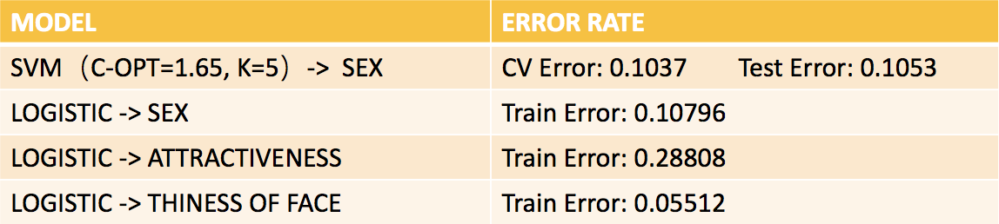
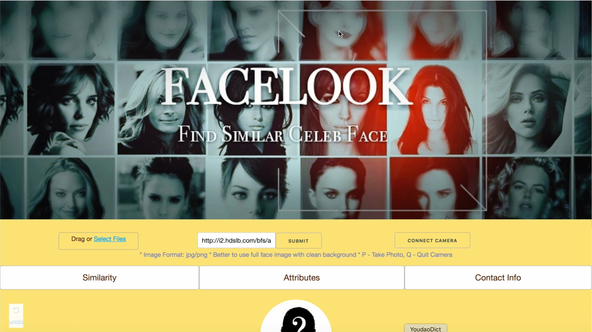
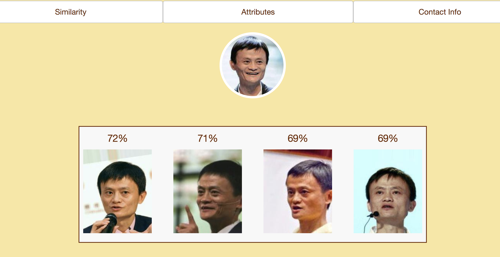
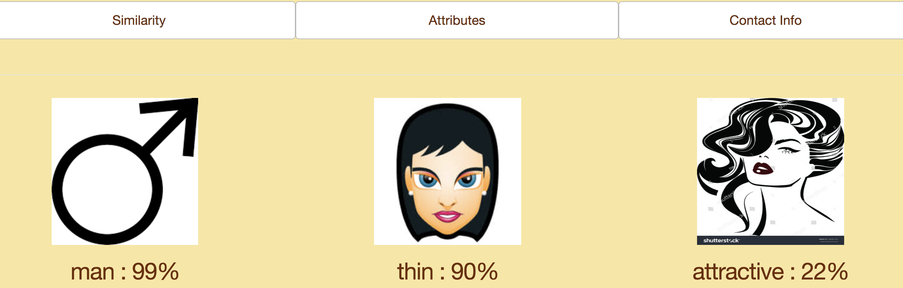

# ADS Project 5: Face Recognition - A Python Dash Web App

Term: Spring 2018

+ Team #3
+ Projec title: "FACELOOK" - A Python Dash Face Recognition Web App
+ Link: https://prezi.com/qdc1ljheqp93/
+ Team members

   - Guo, Du <dg2999@columbia.edu>
   - Guo, Tao <tg2620@columbia.edu>
   - Jiang, Yiran <yj2462@columbia.edu>
   - Liu, Fangbing <fl2476@columbia.edu>
   - Wang, Jingyi <jw3592@columbia.edu>

## Project summary:

The design and implemention of a python Dash Web Application based on Face Recognition.

### Technique Principle:
 
Utilizing Tensorflow as a pre-trained model to extract feature of over two hundred thousand images as a matrix of 512 columns and designing algorithm to handle the extraction of feature from new test image. Improving the face detect algorithm provided by OpenCV to better fit our data set. Using cosine similarity for the image matching and the corresponding similarity. Using Logistics model to train and predict for sex, attractiveness and face shape (We also try the SVM model, with the similar error rate as logistic. However, Logistic is faster and we obtain the estimated probability for each class). Building the dash page application, which start from scratch and implement all the function inside.

***<p align="center">Error Rate for Logistic & SVM</p>***
  <br>
 
### Application Guideline:

This application with a user friendly interface can be used by people without much learning steps. Simply click with the button. You can enjoy the wonderful experence with our application.<br>
<br>
Three ways of importing of the test image. We manage to upload one's photo through the local file(some test pictures can be found under data/test/test_picture),  source the image through the url address on the Internet, and implement the counnection with your own camera so that you can take a photo immediately and do the following matching and analysis. After we get the test image, we manage to find the image of the celebrity that you resemble the most, giving the similarity rate from tab1. While from tab2 we get some attributes of the image of yourself, such as your sex likelihood, your attractiveness as well as the thiness of one's face.
<br>

**Note: You need to download our NPY file feature.npy(https://drive.google.com/file/d/1iIwBS4Uq-X6a1Nl9MrWz7UAiugq6hDhu/view?usp=sharing) as well as the 200,000 images in img_ align_celeba.zip(then unzip it）under img folder in CelebA dataset(https://www.dropbox.com/sh/8oqt9vytwxb3s4r/AAB06FXaQRUNtjW9ntaoPGvCa?dl=0) and put them under /data. Then run the app.py file in /doc.**

***<p align="center">The Cover of our Web page</p>***
  <br>
  
***<p align="center">Similarity for Jack Ma</p>***
  <br>
  
  
 ***<p align="center">Attributes for Jack Ma</p>***
  <br>
  

	
**Contribution statement**: ([default](doc/a_note_on_contributions.md)) 

- Guo, Du: Using models trained by Tao Guo to make predictions. Constructed Attributes dash page to show the results of our predictions, and combined codes of other members. 
- Guo, Tao: Training part of the image for feature extracture. Building and training the Logistic Model for gender, attractiveness and face shape. Summary and Presentation with Yiran Jiang.
- Jiang, Yiran: Leader of the project. Collecting data. Improving and Running facenet CNN model for extracting features. Designing algorithm for cropping images. Running and evaluating SVM model on sex classification. Dash code and functions design. Dash Interactive and Logic design. Presentation.
- Liu, Fangbing: Designed python dash page, helped with processing data and organizing code.
- Wang, Jingyi:  Designed camera connection, most part of the finding similar celebrity photo section, and python dash layout, and part of the image feature extracture process.

Following [suggestions](http://nicercode.github.io/blog/2013-04-05-projects/) by [RICH FITZJOHN](http://nicercode.github.io/about/#Team) (@richfitz). This folder is orgarnized as follows.

```
proj/
├── lib/
├── data/
├── doc/
├── figs/
└── output/
```

Please see each subfolder for a README file.
