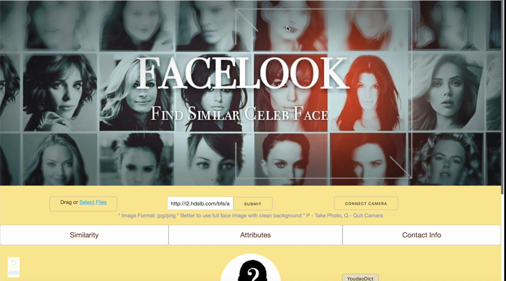
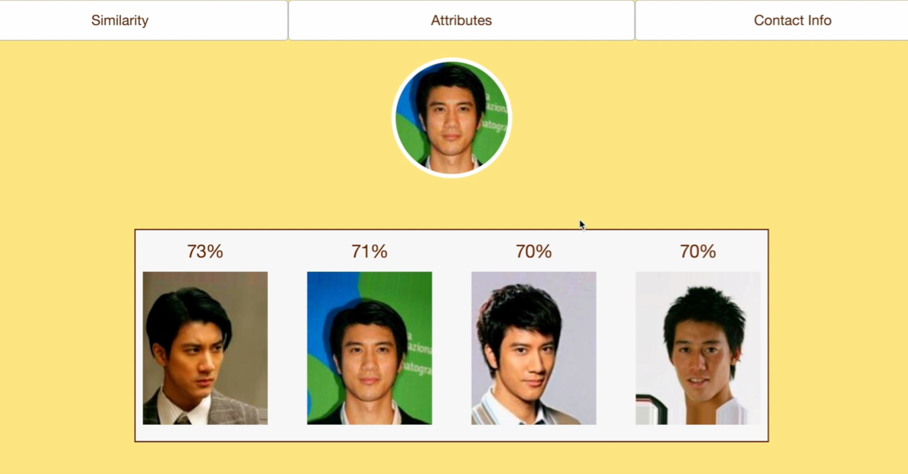
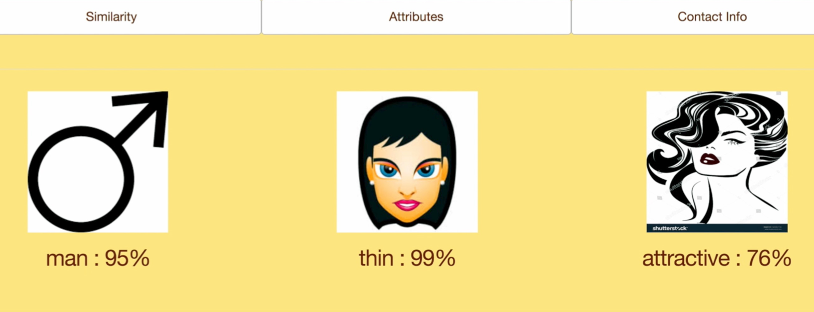

# ADS Project 5: Face Recognition - A Python Dash Web App

Term: Spring 2018

+ Team #3
+ Projec title: "FACELOOK" - A Python Dash Face Recognition Web App
+ Team members

   - Guo, Du <dg2999@columbia.edu>
   - Guo, Tao <tg2620@columbia.edu>
   - Jiang, Yiran <yj2462@columbia.edu>
   - Liu, Fangbing <fl2476@columbia.edu>
   - Wang, Jingyi <jw3592@columbia.edu>

## Project summary:

The design and implemention of a python Dash Web Application based on  Face Recognition.

### Technique Principle:
 
Utilizing Tensorflow as  a pre-trained model to extract feature of over twenty thousand images as a matrix of  512 columns. Using cosine similarity for the image matching and the corresponding similarity. Using Logistics model to train and predict for gender, attractiveness and face shape (We also try the svm model, with the same error rate as logistic. However, Logistic is faster and we obtain the probability for each class). Building the dash page application and implement all the function inside.
 
### Application guideline:
 
Three ways of importing of the test image. We manage to upload one's photo through the local file,  sourcing the image through the url address one the Internet and also implement the counnection with your own camera. So that you can take a photo immediately and do the following matching and analysis. After we get the test image, we manage to find the imag of the celebrity that you resemble the most, giving the similarity rate from tab1. While from tab2 we get some attributes of the image of yourself, such as your gender likelihood, your attractiveness as well as the thiness of one's face.

>>>The Cover of our Web page
  
  
>>>Similarity for Leehom Wang
  
  
  
 >>>Attributes for Leehom Wang
  
  

	
**Contribution statement**: ([default](doc/a_note_on_contributions.md)) 

- Guo, Du: 
- Guo, Tao: Training part of the image for feature extracture. Building and training the Logistic Model for gender, attractiveness and face shape. Summary and Presentation with Yiran Jiang.
- Jiang, Yiran:  
- Liu, Fangbing: Designed python dash page, helped with processing data and organizing code.
- Wang, Jingyi:  I designed camera connection and photo similarity, updated finding 4 similar celebrity face section, help designed python dash page and processed data.

Following [suggestions](http://nicercode.github.io/blog/2013-04-05-projects/) by [RICH FITZJOHN](http://nicercode.github.io/about/#Team) (@richfitz). This folder is orgarnized as follows.

```
proj/
├── lib/
├── data/
├── doc/
├── figs/
└── output/
```

Please see each subfolder for a README file.
